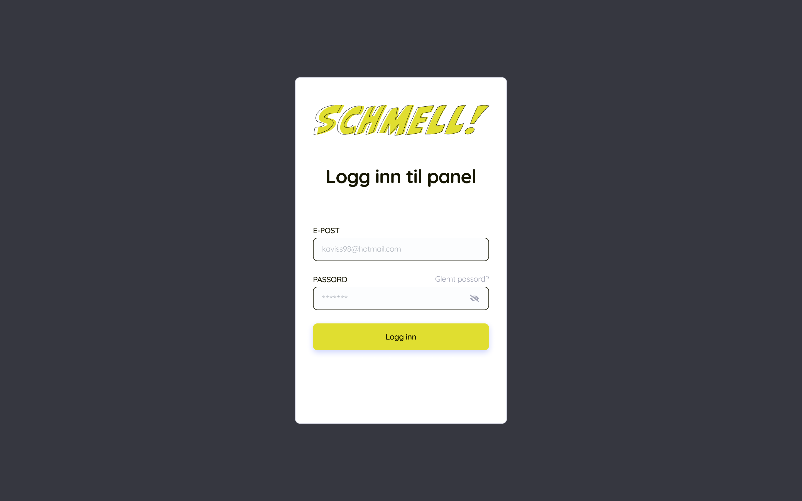
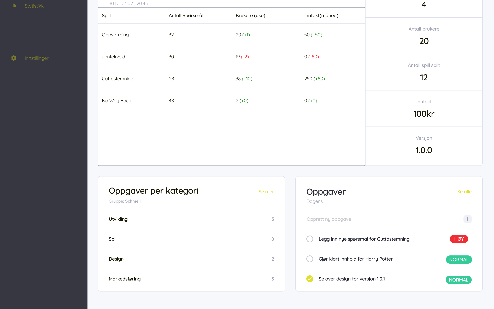
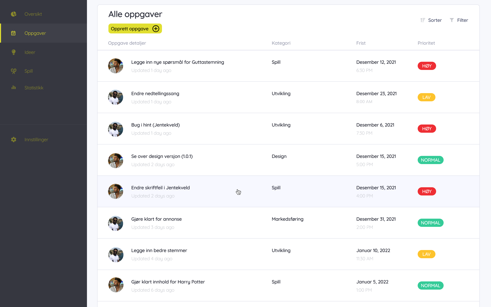
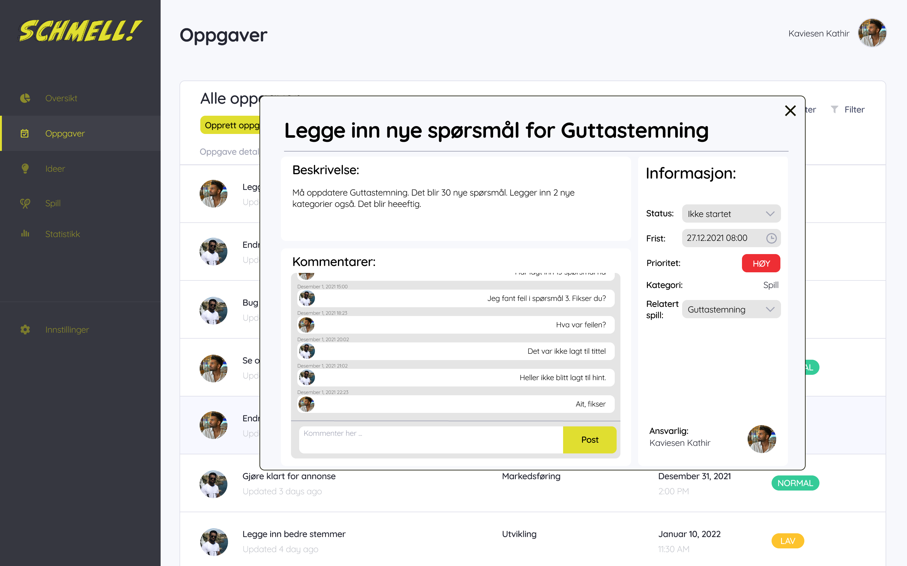
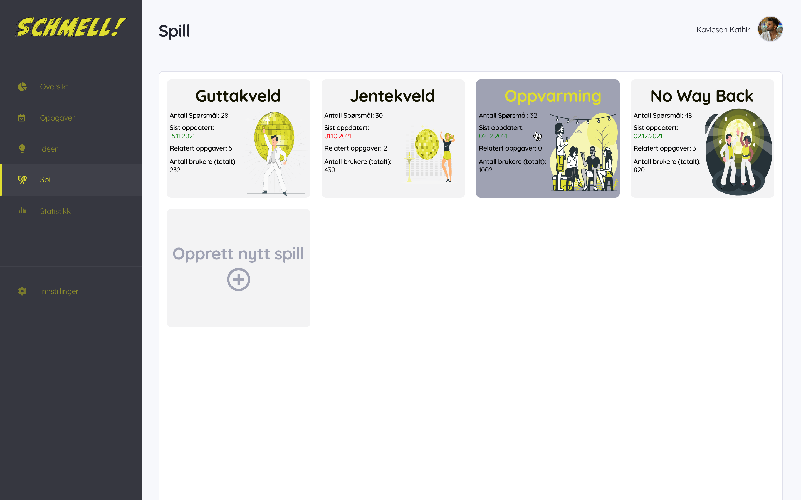
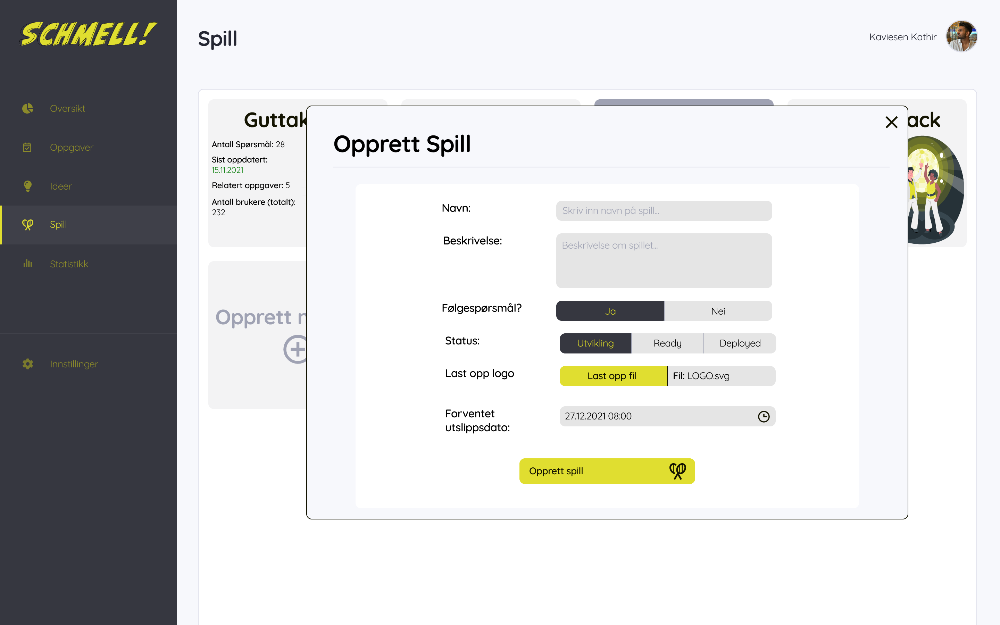
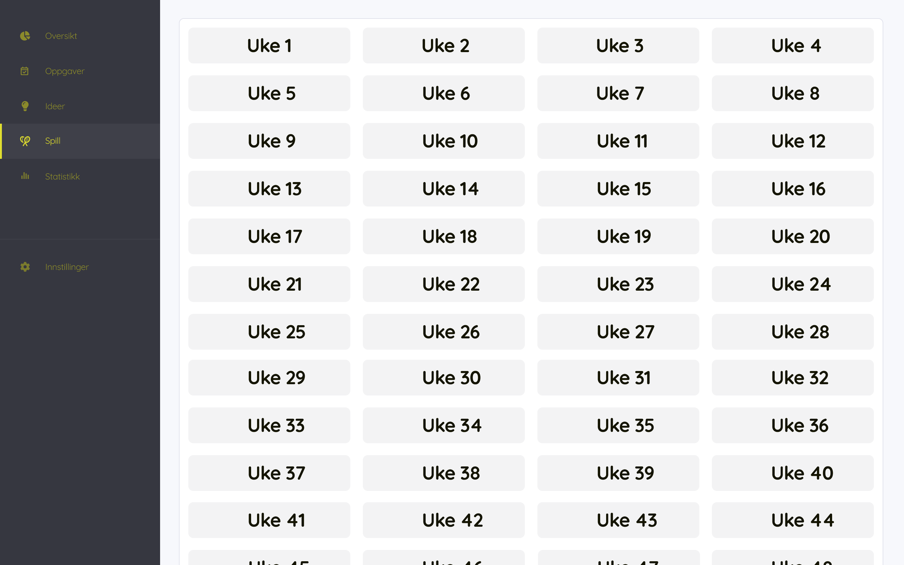
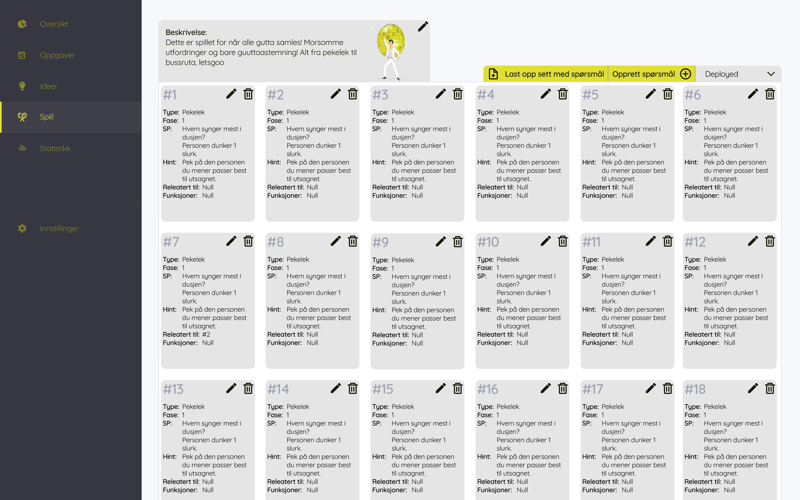

<div id="top"></div>


<!-- PROJECT LOGO -->
<br />
<div align="center">
  <a href="https://github.com/francinv/schmell-admin-panel/">
    
  </a>

<h3 align="center">Schmell Admin Panel</h3>

  <p align="center">
    This is an admin-panel. The panel will be used to administer a mobile application. 
    <br />
    <a href="https://github.com/francinv/schmell-admin-panel/"><strong>Explore the docs »</strong></a>
    <br />
    <br />
    <a href="https://www.figma.com/proto/JRefmkvvkehRxD8ErPDeIx/Admin-Web-APP?node-id=4%3A80&scaling=min-zoom&page-id=0%3A1&starting-point-node-id=4%3A80">View Demo</a>
    ·
    <a href="https://github.com/francinv/schmell-admin-panel/issues">Report Bug</a>
    ·
    <a href="https://github.com/francinv/schmell-admin-panel/issues">Request Feature</a>
  </p>
</div>


<!-- TABLE OF CONTENTS -->
<details>
  <summary>Table of Contents</summary>
  <ol>
    <li>
      <a href="#about-the-project">About The Project</a>
      <ul>
        <li><a href="#built-with">Built With</a></li>
      </ul>
    </li>
    <li>
      <a href="#getting-started">Getting Started</a>
      <ul>
        <li><a href="#prerequisites">Prerequisites</a></li>
        <li><a href="#installation">Installation</a></li>
      </ul>
    </li>
    <li><a href="#usage">Usage</a></li>
    <li><a href="#roadmap">Roadmap</a></li>
    <li><a href="#contact">Contact</a></li>
    <li><a href="#acknowledgments">Acknowledgments</a></li>
  </ol>
</details>


<!-- ABOUT THE PROJECT -->
## About The Project

[![Product Name Screen Shot][product-screenshot]](https://www.figma.com/proto/JRefmkvvkehRxD8ErPDeIx/Admin-Web-APP?node-id=4%3A80&scaling=min-zoom&page-id=0%3A1&starting-point-node-id=4%3A80)

### Built With

* [React.js](https://reactjs.org/)
* [Django](https://www.djangoproject.com/)
* [Material UI](https://mui.com/)
* [Bootstrap](https://getbootstrap.com)

<p align="right">(<a href="#top">back to top</a>)</p>


<!-- GETTING STARTED -->
## Getting Started

Here you will get information about how you can run the app both locally and remote.
When the app is deployed you will be able to access the website in question to run the app. 

### Prerequisites

This is what you need before you start to install the app.
* npm
  ```sh
  npm install npm@latest -g
  ```
* django
  ```sh
  pip install django
  ```


### Installation and running locally

**Clone the repo**
* Clone the repo
   ```sh
   git clone https://github.com/francinv/schmell-admin-panel.git
   ```
#### Run server
1. go into server directory
    ```sh
    cd server
    ```
2. install requirements
    ```sh
    pip install requirements.txt
    ```
3. run server
    ```sh
    python manage.py runserver
    ```

**The server should now be running**

#### Run application
1. go into frontend directory
    ```sh
    cd frontend
    ```
2. install requirements
    ```sh
    yarn install
    ```
3. run application
    ```sh
    yarn start
    ```

**The app will now be running on localhost.**

<p align="right">(<a href="#top">back to top</a>)</p>


<!-- USAGE EXAMPLES -->
## Usage

You will find examples of how you can use the application and some screenshots. I recommend using the figma prototype for better understanding of the app.

<div align="center">
    
    
    
    
    
    
    
    
</div>

_I recommend to use Figma to see how the app should work and examples [Prototype](https://www.figma.com/proto/JRefmkvvkehRxD8ErPDeIx/Admin-Web-APP?node-id=4%3A80&scaling=min-zoom&page-id=0%3A1&starting-point-node-id=4%3A80)_

<p align="right">(<a href="#top">back to top</a>)</p>

<!-- ROADMAP -->
## Roadmap

- [] Log-In with authentication
- [] Games
    - [] See all games and weeks
    - [] See questions matching weeks and game
    - [] Add/delete/edit question

**This roadmap will be updated for every release**

See the [open issues](https://github.com/francinv/schmell-admin-panel/issues) for a full list of proposed features (and known issues).

<p align="right">(<a href="#top">back to top</a>)</p>


<!-- CONTACT -->
## Contact

Francin Vincent - [@francinvincent](https://www.facebook.com/francinvincent/) - francin.vinc@gmail.com

Project Link: [https://github.com/francinv/schmell-admin-panel/](https://github.com/francinv/schmell-admin-panel/)

<p align="right">(<a href="#top">back to top</a>)</p>


[product-screenshot]: docs/img/schmelladmin.png